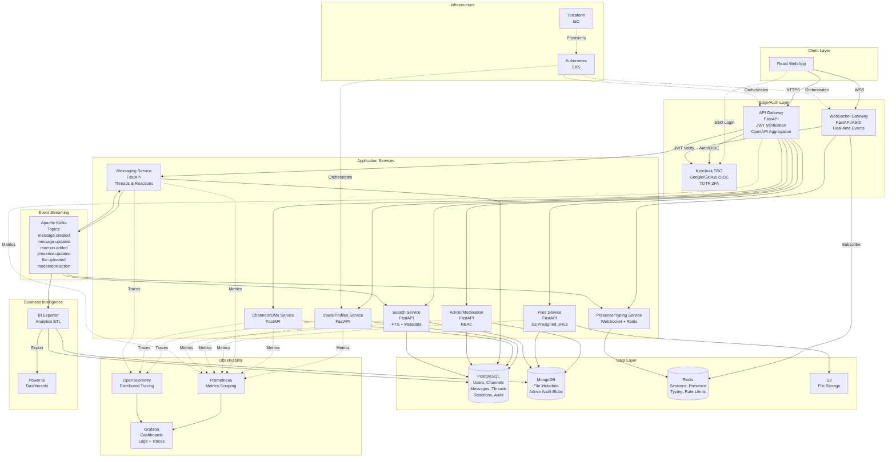
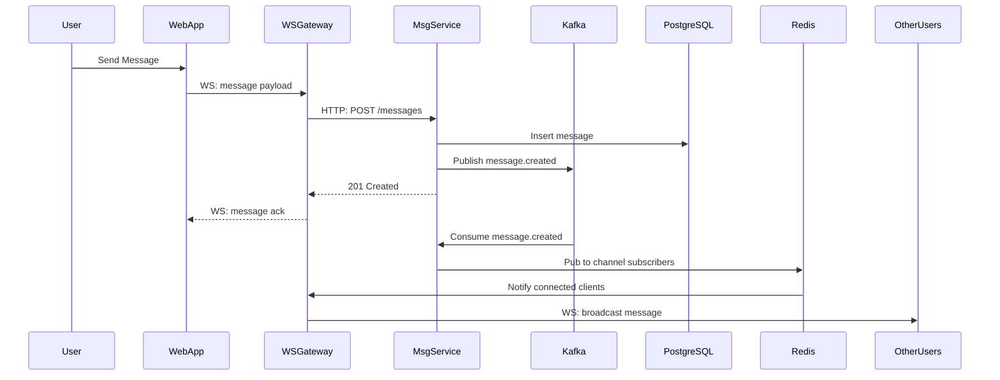
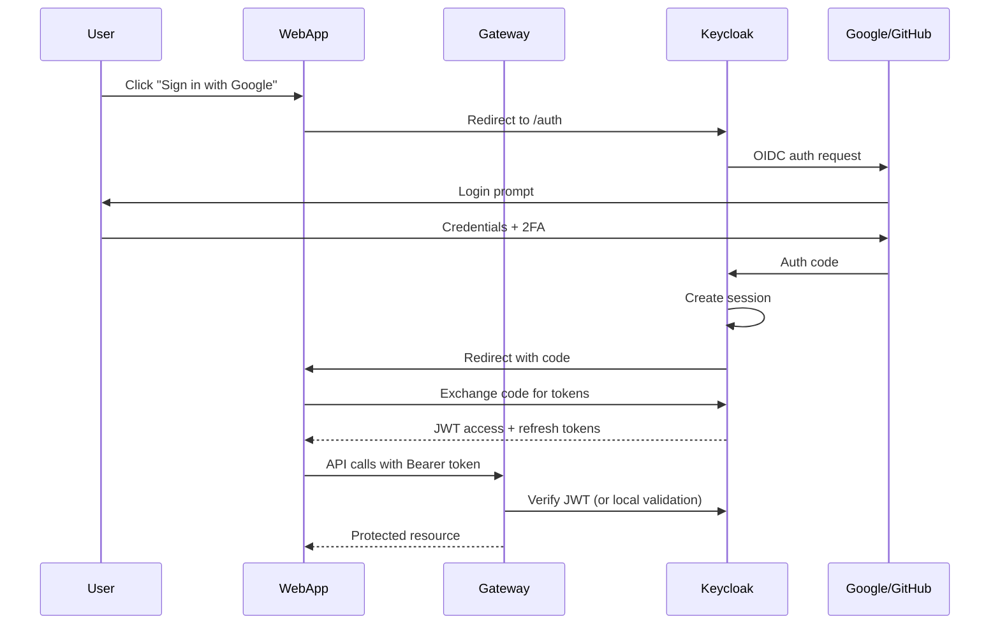
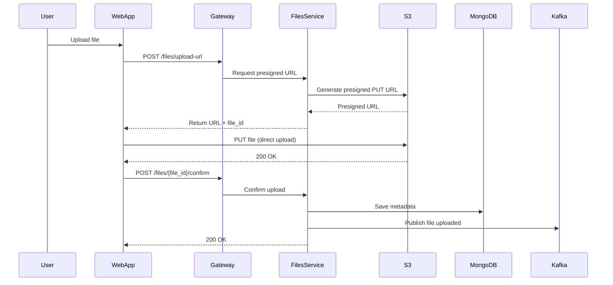

# CoLink Architecture

## System Architecture Diagram



## Data Flow Diagrams

### Real-time Message Flow



### Authentication Flow



### File Upload Flow



## Service Responsibilities (RACI)

| Responsibility | Gateway | Users | Channels | Messaging | Presence | Files | Search | Admin | Keycloak |
|---------------|---------|-------|----------|-----------|----------|-------|--------|-------|----------|
| **Authentication** | A | I | I | I | I | I | I | I | R |
| **Authorization/RBAC** | R | C | C | C | C | C | C | A | R |
| **User CRUD** | C | R/A | I | I | - | I | I | C | C |
| **Profile Management** | C | R/A | I | I | I | I | I | C | - |
| **Channel CRUD** | C | I | R/A | I | I | I | I | C | - |
| **DM Sessions** | C | I | R/A | I | I | I | I | - | - |
| **Message CRUD** | C | I | C | R/A | I | I | C | C | - |
| **Threads** | C | I | C | R/A | I | - | C | C | - |
| **Reactions** | C | I | C | R/A | I | - | C | - | - |
| **Presence/Status** | I | I | I | I | R/A | - | - | - | - |
| **Typing Indicators** | I | - | I | I | R/A | - | - | - | - |
| **File Upload/Download** | C | I | I | I | - | R/A | I | C | - |
| **File Metadata** | C | I | I | I | - | R/A | C | C | - |
| **Message Search** | C | I | C | I | - | - | R/A | C | - |
| **File Search** | C | I | C | - | - | C | R/A | C | - |
| **User Moderation** | C | C | C | C | - | C | C | R/A | C |
| **Content Moderation** | C | - | C | C | - | C | C | R/A | - |
| **Audit Logging** | I | C | C | C | - | C | C | R/A | - |
| **Rate Limiting** | R/A | - | - | - | - | - | - | - | - |
| **OpenAPI Docs** | A | R | R | R | R | R | R | R | - |
| **Metrics/Tracing** | R | R | R | R | R | R | R | R | - |
| **Kafka Events** | - | I | C | R/A | R/A | R/A | C | C | - |

**Legend:**
- **R** = Responsible (does the work)
- **A** = Accountable (owns the outcome)
- **C** = Consulted (provides input)
- **I** = Informed (receives updates)

## Technology Stack Summary

| Layer | Technology | Purpose |
|-------|-----------|---------|
| **Frontend** | React.js (Vite) | Web UI |
| **API Framework** | FastAPI | REST APIs, WebSockets |
| **Auth/Identity** | Keycloak | SSO, OIDC (Google/GitHub), TOTP 2FA |
| **API Gateway** | FastAPI | Routing, authZ, OpenAPI aggregation |
| **SQL Database** | PostgreSQL | Users, channels, messages, threads |
| **NoSQL Database** | MongoDB | File metadata, admin audit |
| **Cache/PubSub** | Redis | Sessions, presence, typing, rate limits |
| **Object Storage** | AWS S3 | File storage |
| **Event Streaming** | Apache Kafka | Async events, event sourcing |
| **Container Runtime** | Docker | Containerization |
| **Orchestration** | Kubernetes (EKS) | Container orchestration |
| **IaC** | Terraform | Infrastructure provisioning |
| **CI/CD** | GitHub Actions | Build, test, deploy pipelines |
| **Metrics** | Prometheus | Time-series metrics |
| **Dashboards** | Grafana | Observability dashboards |
| **Tracing** | OpenTelemetry | Distributed tracing |
| **Business Intelligence** | Power BI | Analytics dashboards |

## Data Model Overview

### PostgreSQL Schema

**Users & Auth:**
- `users` - id, keycloak_id, email, username, display_name, avatar_url, created_at, updated_at
- `user_status` - user_id, status_text, status_emoji, status_expiry, updated_at
- `sessions` - session_id, user_id, refresh_token_hash, expires_at

**Workspaces & Channels:**
- `workspaces` - id, name, slug, created_by, created_at
- `channels` - id, workspace_id, name, description, is_private, created_by, created_at
- `channel_members` - channel_id, user_id, role (owner/admin/member), joined_at
- `direct_messages` - id, workspace_id, created_at
- `dm_participants` - dm_id, user_id, joined_at

**Messages & Threads:**
- `messages` - id, channel_id, dm_id, user_id, content, edited_at, deleted_at, created_at
- `threads` - id, parent_message_id, reply_count, last_reply_at
- `thread_messages` - id, thread_id, user_id, content, created_at
- `reactions` - id, message_id, user_id, emoji, created_at

**Audit:**
- `audit_log` - id, user_id, action, resource_type, resource_id, metadata, created_at

### MongoDB Collections

**Files:**
```json
{
  "_id": "ObjectId",
  "file_id": "uuid",
  "workspace_id": "uuid",
  "channel_id": "uuid",
  "dm_id": "uuid",
  "message_id": "uuid",
  "uploader_id": "uuid",
  "filename": "string",
  "content_type": "string",
  "size_bytes": "number",
  "s3_bucket": "string",
  "s3_key": "string",
  "s3_version_id": "string",
  "versions": [{"version_id": "string", "uploaded_at": "datetime"}],
  "metadata": {"width": 0, "height": 0},
  "virus_scan": {"status": "clean|infected|pending", "scanned_at": "datetime"},
  "created_at": "datetime",
  "updated_at": "datetime"
}
```

**Admin Audit Blobs:**
```json
{
  "_id": "ObjectId",
  "audit_id": "uuid",
  "action_type": "string",
  "actor_id": "uuid",
  "target_id": "uuid",
  "details": {},
  "timestamp": "datetime"
}
```

### Redis Data Structures

**Presence:**
- `presence:{user_id}` - Hash: {status, last_seen, connection_id} (TTL: 5 min)
- `presence:channel:{channel_id}` - Set: [user_id1, user_id2, ...] (TTL: 5 min)

**Typing:**
- `typing:{channel_id}` - Set: [user_id1, user_id2, ...] (TTL: 5 sec)

**Sessions:**
- `session:{session_id}` - Hash: {user_id, expires_at} (TTL: refresh token lifetime)

**Rate Limiting:**
- `ratelimit:{user_id}:{endpoint}` - Counter (TTL: 1 min)

**WebSocket Subscriptions:**
- `ws:channel:{channel_id}` - Set: [connection_id1, connection_id2, ...]
- `ws:user:{user_id}` - Set: [connection_id1, connection_id2, ...]

### Kafka Topics & Schemas

**message.created:**
```json
{
  "message_id": "uuid",
  "channel_id": "uuid",
  "user_id": "uuid",
  "content": "string",
  "timestamp": "datetime"
}
```

**message.updated:**
```json
{
  "message_id": "uuid",
  "content": "string",
  "edited_at": "datetime"
}
```

**reaction.added:**
```json
{
  "reaction_id": "uuid",
  "message_id": "uuid",
  "user_id": "uuid",
  "emoji": "string",
  "timestamp": "datetime"
}
```

**presence.updated:**
```json
{
  "user_id": "uuid",
  "status": "online|away|offline",
  "timestamp": "datetime"
}
```

**file.uploaded:**
```json
{
  "file_id": "uuid",
  "uploader_id": "uuid",
  "channel_id": "uuid",
  "filename": "string",
  "size_bytes": "number",
  "timestamp": "datetime"
}
```

**moderation.action:**
```json
{
  "action_id": "uuid",
  "moderator_id": "uuid",
  "action_type": "warn|mute|kick|ban",
  "target_user_id": "uuid",
  "reason": "string",
  "timestamp": "datetime"
}
```

## Security Considerations

1. **Authentication:** All API requests require valid JWT from Keycloak
2. **Authorization:** Role-based access control (RBAC) via Keycloak roles
3. **TLS:** All external traffic over HTTPS/WSS
4. **Secrets:** Stored in Kubernetes Secrets, AWS Secrets Manager, or HashiCorp Vault
5. **CORS:** Configured on Gateway to allow frontend origin only
6. **Rate Limiting:** Implemented at Gateway level using Redis
7. **Input Validation:** FastAPI Pydantic models + content size limits
8. **File Upload:** Virus scanning, type validation, presigned URLs
9. **CSRF:** Token-based protection for state-changing operations
10. **SQL Injection:** Parameterized queries via SQLAlchemy ORM

## Deployment Architecture

**AWS Resources (via Terraform):**
- EKS cluster (multi-AZ)
- RDS PostgreSQL (Multi-AZ, automated backups)
- DocumentDB/MongoDB Atlas
- ElastiCache Redis (cluster mode)
- MSK (Managed Kafka)
- S3 (versioning, lifecycle policies)
- ALB/NLB (ingress)
- Route53 (DNS)
- ACM (TLS certificates)
- IAM roles (IRSA for pods)
- VPC, subnets, security groups

**Kubernetes Namespaces:**
- `colink-prod`
- `colink-staging`
- `colink-observability`
- `colink-infra` (Keycloak, etc.)

## Observability Strategy

**Metrics (Prometheus):**
- RED metrics: Rate, Errors, Duration (per service, per endpoint)
- Resource metrics: CPU, memory, disk, network
- Business metrics: DAU, messages/sec, file uploads/sec
- SLIs: API latency p50/p95/p99, error rate, availability

**Logs (Structured JSON):**
- Application logs: service, level, timestamp, trace_id, message, context
- Access logs: method, path, status, latency, user_id
- Audit logs: action, actor, target, timestamp

**Traces (OpenTelemetry):**
- End-to-end request traces across services
- Gateway → Service → Database spans
- Correlation with logs via trace_id

**Dashboards (Grafana):**
- Service health (RED metrics per service)
- Infrastructure health (nodes, pods, resources)
- Business KPIs (DAU, MAU, retention, engagement)
- Alerts (error rate > 5%, p99 latency > 2s, etc.)

## Scalability & Performance

**Horizontal Scaling:**
- Stateless services: scale via HPA based on CPU/memory
- WebSocket Gateway: sticky sessions or Redis pub/sub for broadcast
- PostgreSQL: read replicas for read-heavy queries
- Redis: cluster mode for sharding

**Caching Strategy:**
- User profiles: 5-minute TTL in Redis
- Channel metadata: 1-minute TTL
- Message history: paginated, no cache (freshness priority)

**Rate Limiting:**
- Per-user: 100 req/min for reads, 20 req/min for writes
- Per-IP: 1000 req/min
- WebSocket: 10 messages/sec per user

## Disaster Recovery

- RDS automated backups (daily, 7-day retention)
- S3 versioning + lifecycle to Glacier
- Kafka topic replication factor: 3
- PITR (Point-In-Time Recovery) for PostgreSQL
- Runbooks for service restoration
